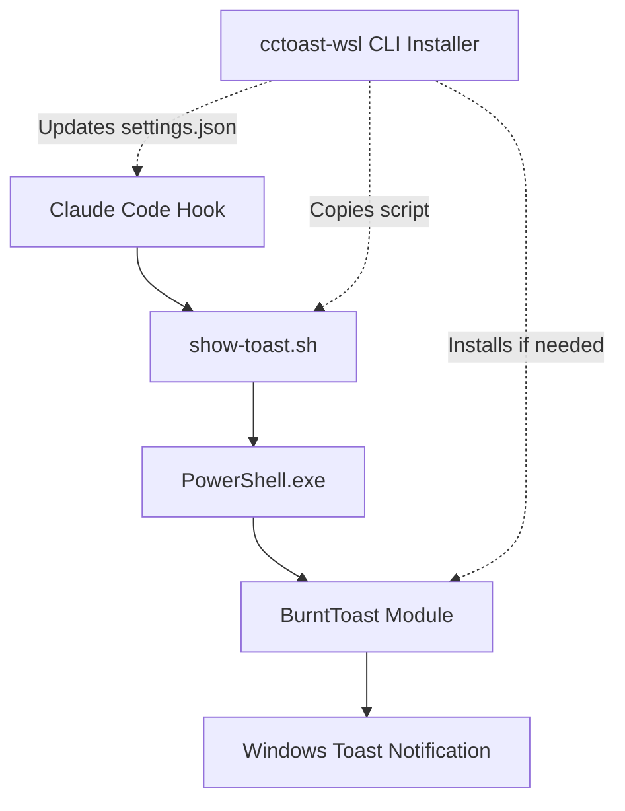

# cctoast-wsl
Use hooks in Claude Code to trigger Windows toast notifications with sounds, messages, titles, and images, from inside WSL.

## Demo
<!-- GIF placeholder - TODO: Record installation and notification demo -->


## How It Works



## Installation

### Automatic (Recommended)
```bash
npx @claudes-world/cctoast-wsl
```

### Manual Installation

**Warning**: Only place the script outside your project directory for security. Editable executable hook files in project directories pose prompt injection risks.

1. **Download the script**:
   ```bash
   # Create hooks directory
   mkdir -p ~/.claude/hooks
   
   # Download show-toast.sh to hooks directory
   curl -o ~/.claude/hooks/show-toast.sh https://raw.githubusercontent.com/claude-ai/cctoast-wsl/main/scripts/show-toast.sh
   
   # Make executable
   chmod 500 ~/.claude/hooks/show-toast.sh
   ```

2. **Add to Claude settings**:
   Edit `~/.claude/settings.json`:
   ```json
   {
     "hooks": {
       "notification": [
         "/home/username/.claude/hooks/show-toast.sh --notification-hook"
       ],
       "stop": [
         "/home/username/.claude/hooks/show-toast.sh --stop-hook"
       ]
     }
   }
   ```

## Documentation

### Planning & Requirements
- **[Product Requirements](docs/PRD.md)** - Complete specifications including CLI flags, security requirements, and success metrics
- **[Implementation Plan](docs/IMPLEMENTATION_PLAN.md)** - 8-milestone roadmap with detailed tasks and acceptance criteria

### Technical Design
- **[Architecture](docs/ARCHITECTURE.md)** - System design, component interactions, and technical decisions
- **[BurntToast Reference](docs/BurntToast_manpage.txt)** - PowerShell module documentation for Windows toast notifications

### Development
- **[Developer Workflow](docs/DEVELOPER_WORKFLOW.md)** - Setup, testing, debugging, and contribution guidelines
