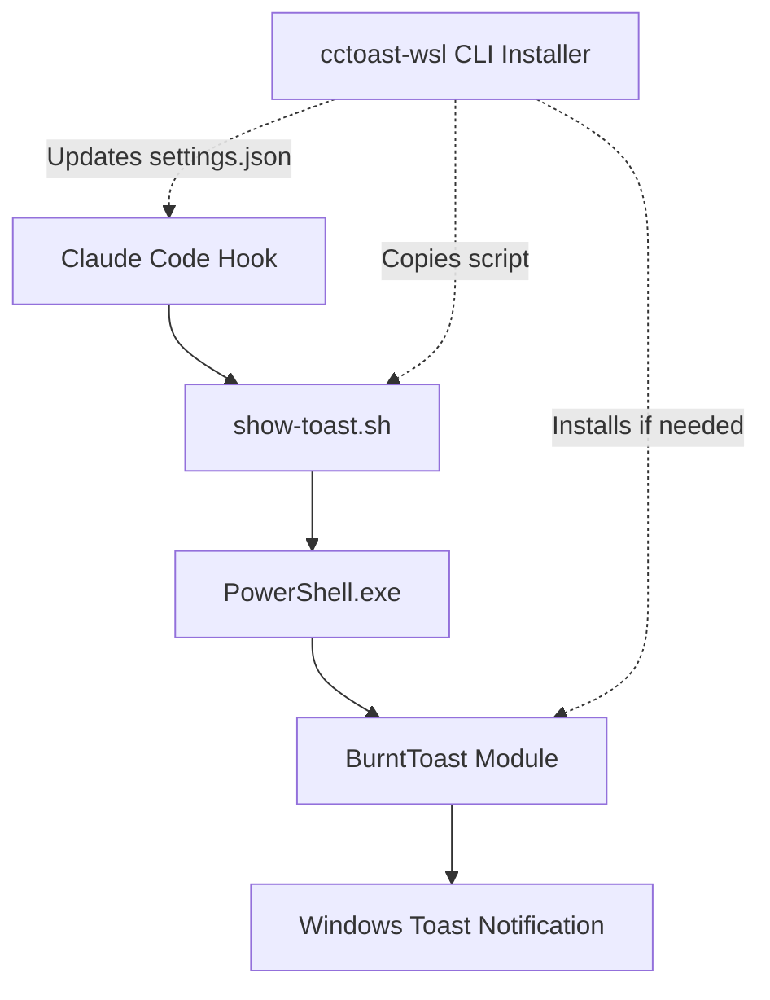

# cctoast-wsl

[](https://github.com/claudes-world/cctoast-wsl/actions)
[](https://codecov.io/gh/claudes-world/cctoast-wsl)
[](https://www.npmjs.com/package/@claude/cctoast-wsl)
[](LICENSE)

> **Secure, zero-admin utility** that enables Windows toast notifications from WSL for Claude Code hooks using PowerShell's BurntToast module.

Transform your Claude Code workflow with native Windows notifications that appear when Claude is waiting for input or completes tasks - all from within WSL with no system-level changes required.

## Demo

> [!NOTE]  
> **Animated demos coming soon** - GIF recordings of toast notifications and CLI installation will be added in a future release

<!-- GIF placeholder - TODO: Record toast notification demo -->
<div align="center">
  
  <p style="font-size: 12px; color: #666;">Product Demo</p>
</div>

## How It Works



## Quick Start

Get Windows toast notifications working in under 2 minutes:

1. **Install**: `npx @claude/cctoast-wsl`
2. **Test**: Run Claude Code - notifications appear automatically  
3. **Done**: Toast notifications now work from WSL!

> [!TIP]  
> Installation completes in under 30 seconds and requires no admin privileges. BurntToast PowerShell module is automatically installed if needed (user consent required).

### One-line installation
```bash
# Recommended: Global installation with interactive prompts
npx @claude/cctoast-wsl

# Alternative: Quiet install for CI/scripts
npx @claude/cctoast-wsl --global --quiet
```

<!-- placeholder for screen recording of install CLI options -->
<div align="center">
  
  <p style="font-size: 12px; color: #666;">CLI Installer Demo</p>
</div>

## CLI Reference

Complete list of available flags and options:

| Flag                                 | Default | Description                                 |
|------------------------------------- | ------- | ------------------------------------------- |
| `--global/-g`                        | ✔       | Install to `~/.claude/…`.                   |
| `--local/-l`                         |         | Install to `.claude/…`.                     |
| `--notification / --no-notification` | on      | Include Notification hook.                  |
| `--stop / --no-stop`                 | on      | Include Stop hook.                          |
| `--sync`                             | off     | When local, modify tracked `settings.json`. |
| `--print-instructions/-p`            |         | Show usage & exit.                          |
| `--json`                             | off     | Machine‑readable summary.                   |
| `--dry-run/-n`                       |         | Preview without writes.                     |
| `--force/-f`                         |         | Bypass failed checks (except BurntToast).   |
| `--quiet/-q`                         |         | Suppress prompts for CI.                    |
| `--uninstall`                        |         | Remove install (scope prompts).             |
| `--version/-v` `--help/-h`           |         | Meta.                                       |

> [!NOTE]  
> **Defaults**: Global installation + both hooks enabled + no sync  
> **Exit codes**: `0` success · `1` abort · `2` dependency failure · `3` I/O error
> **Interactive flow**: scope → hooks → sync → confirm

### Common usage examples

```bash
# Global installation (recommended)
npx @claude/cctoast-wsl

# Local project installation  
npx @claude/cctoast-wsl --local

# Install only notification hook
npx @claude/cctoast-wsl --no-stop

# Preview changes without installing
npx @claude/cctoast-wsl --dry-run

# Uninstall
npx @claude/cctoast-wsl --uninstall
```

## Manual Installation

>[!CAUTION]
> * **Only place the script outside your project directory, for security.** Executable hook files in project directories (editable by Claude Code) pose risks including from prompt injection.
> * **Never use `sudo` in hook commands/scripts.** This will cause the script to run as root, which is a security risk.

1. **Download the script**:
   ```bash
   # Create hooks directory
   mkdir -p ~/.claude/hooks
   
   # Download show-toast.sh to hooks directory
   curl -o ~/.claude/hooks/show-toast.sh https://raw.githubusercontent.com/claudes-world/cctoast/main/scripts/show-toast.sh
   
   # Make executable
   chmod 500 ~/.claude/hooks/show-toast.sh

   # (Optional) Add alias to PATH
   # Temporary
   alias cctoast="~/.claude/hooks/show-toast.sh"
   # Permanent
   echo 'alias cctoast="~/.claude/hooks/show-toast.sh"' >> ~/.bashrc
   source ~/.bashrc
   ```

2. **Add to Claude settings**:
   Edit `~/.claude/settings.json`:
   ```json
   {
     "hooks": {
       "notification": [
         "/home/username/.claude/hooks/show-toast.sh --notification-hook"
       ],
       "stop": [
         "/home/username/.claude/hooks/show-toast.sh --stop-hook"
       ]
     }
   }
   ```

## Troubleshooting

### Quick fixes for common issues

#### ❌ "PowerShell execution policy" error
```bash
# Fix execution policy for current user only (no admin required)
powershell.exe -Command "Set-ExecutionPolicy -Scope CurrentUser RemoteSigned"
```

#### ❌ "BurntToast module not found"
```bash
# The installer offers automatic installation, but if needed manually:
powershell.exe -Command "Install-Module BurntToast -Scope CurrentUser -Force"

# Verify installation
powershell.exe -Command "Get-Module -ListAvailable -Name BurntToast"
```

#### ❌ No notifications appearing
1. Check that you're in WSL: `echo $WSL_DISTRO_NAME`
2. Test notification manually: `~/.claude/cctoast-wsl/show-toast.sh --title "Test"`
3. Verify Claude hooks: Check `~/.claude/settings.json`

> [!TIP]  
> For more detailed troubleshooting, see the [FAQ](docs/FAQ.md)

## Documentation

### Getting Help
- **[FAQ](docs/user-guides/FAQ.md)** - Common issues and solutions
- **[Manual Installation](docs/user-guides/MANUAL.md)** - Step-by-step installation without npm
- **[Security Guide](docs/user-guides/SECURITY.md)** - Security considerations and best practices
- **[Advanced Usage](docs/user-guides/ADVANCED.md)** - Customization and integration examples

### For Developers
- **[Contributing Guide](CONTRIBUTING.md)** - Development environment and contribution guidelines
- **[Architecture](docs/ai_docx/ARCHITECTURE.md)** - System design and technical decisions
- **[Developer Workflow](docs/ai_docx/DEVELOPER_WORKFLOW.md)** - Setup, testing, and debugging
- **[Documentation Style Guide](docs/ai_docx/DOCUMENTATION_STYLE_GUIDE.md)** - Writing guidelines for human and LLM readers
- **[Writing Docs for AI](docs/ai_docx/WRITING_DOCS_FOR_AI.md)** - Framework for LLM-facing documentation

### Technical Specifications
- **[Product Requirements](docs/ai_docx/PRD.md)** - Complete specifications and success metrics
- **[Implementation Plan](docs/ai_docx/IMPLEMENTATION_PLAN.md)** - 8-milestone development roadmap
- **[BurntToast Reference](docs/ref/BurntToast_manpage.txt)** - PowerShell module documentation

#### CI/CD Pipeline
cctoast-wsl uses optimized GitHub Actions workflows that reduce CI minutes by 70-90%:

- 🧪 **Smart Testing**: Path-based filtering, optimized matrix strategy, conditional execution
- 🏗️ **Multi-Platform CI**: Ubuntu 18/20 + Windows 20 with enhanced caching  
- 📦 **Automated Releases**: Conventional commits → Release Please → npm with provenance
- 🔒 **Security**: SLSA-3 attestation, Dependabot updates, comprehensive security policies

**Workflow Control**: Use `[skip-ci]` and `[skip-review]` flags to control automation
**Local Testing**: `act -j test --dryrun` (requires [nektos/act](https://github.com/nektos/act))

> [!TIP]  
> **CI/CD Optimization Guide**: See [CI/CD Workflows](docs/user-guides/CI-CD.md) for complete details on path filtering, matrix strategies, and workflow control flags.

For development workflows, see [Developer Workflow Guide](docs/ai_docx/DEVELOPER_WORKFLOW.md#cicd-pipeline--testing).

---

## Future TODOs
- [ ] add hook for PreCompact
- [ ] contributing guide
- [x] package CI/CD
- [ ] colored text reference in DOCUMENTATION_STYLE_GUIDE.md using mathjax https://raw.githubusercontent.com/lifeparticle/Markdown-Cheatsheet/refs/heads/main/MathJax.md)

---

<div align="center">
  <h2>
    <b>Claude's World</b>
    <br/>
    <h6>
      
      <p style="font-size: 12px; color: #666;">
        <a href="https://github.com/claudes-world">@claudes-world</a> | 
        <a href="https://claude.do">claude.do</a>
      </p>
    </h6>
  </h2> 

  <br/>
  
  an experimental project by 
  
  <br/>
  
  <a href="https://github.com/mcorrig4">@mcorrig4</a> & <a href="https://github.com/chaintail">@chaintail</a>
  
  <br/>
  <br/>

  <h6>
    <a href="https://chaintail.xyz">
      <p style="font-size: 12px; color: #666;">
        
        <p>
          Chaintail Labs
        </p>
      </p>
    </a>
  </h6>
  <p style="font-size: 12px; color: #666;"><i>Copyright (c) 2025 Chaintail Labs</i></p>
</div>
<!--
|  |
|:-:|
| Chaintail Labs |
| |
| Copyright (c) 2025 Chaintail Labs |
  -->
