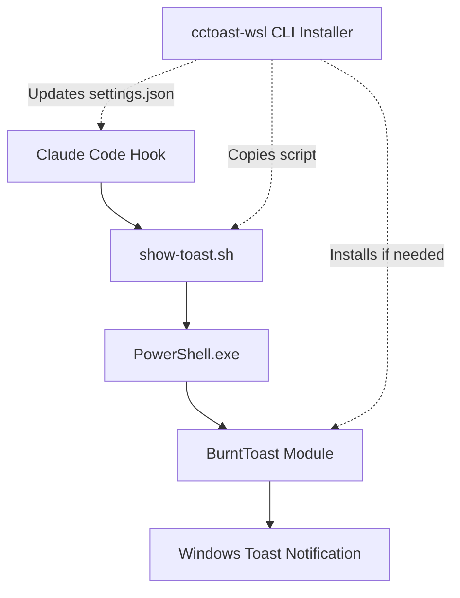

# cctoast-wsl
Use hooks in Claude Code to trigger Windows toast notifications with sounds, messages, titles, and images, from inside WSL.

## Demo
<!-- GIF placeholder - TODO: Record toast notification demo -->
<div style="text-align: center;">
  
  <p style="font-size: 12px; color: #666;">Product Demo</p>
</div>

## How It Works



## Quick Start

### Automatic Installation (Recommended)
```bash
npx @claudes-world/cctoast-wsl
```

<!-- placeholder for screen recording of install CLI options -->
<div style="text-align: center;">
  
  <p style="font-size: 12px; color: #666;">CLI Installer Demo</p>
</div>

## Manual Installation

>[!CAUTION]
> * **Only place the script outside your project directory, for security.** Executable hook files in project directories (editable by Claude Code) pose risks including from prompt injection.
> * **Never use `sudo` in hook commands/scripts.** This will cause the script to run as root, which is a security risk.

1. **Download the script**:
   ```bash
   # Create hooks directory
   mkdir -p ~/.claude/hooks
   
   # Download show-toast.sh to hooks directory
   curl -o ~/.claude/hooks/show-toast.sh https://raw.githubusercontent.com/claudes-world/cctoast/main/scripts/show-toast.sh
   
   # Make executable
   chmod 500 ~/.claude/hooks/show-toast.sh

   # (Optional) Add alias to PATH
   # Temporary
   alias cctoast="~/.claude/hooks/show-toast.sh"
   # Permanent
   echo 'alias cctoast="~/.claude/hooks/show-toast.sh"' >> ~/.bashrc
   source ~/.bashrc
   ```

2. **Add to Claude settings**:
   Edit `~/.claude/settings.json`:
   ```json
   {
     "hooks": {
       "notification": [
         "/home/username/.claude/hooks/show-toast.sh --notification-hook"
       ],
       "stop": [
         "/home/username/.claude/hooks/show-toast.sh --stop-hook"
       ]
     }
   }
   ```

## Documentation

### Planning & Requirements
- **[Product Requirements](docs/PRD.md)** - Complete specifications including CLI flags, security requirements, and success metrics
- **[Implementation Plan](docs/IMPLEMENTATION_PLAN.md)** - 8-milestone roadmap with detailed tasks and acceptance criteria

### Technical Design
- **[Architecture](docs/ARCHITECTURE.md)** - System design, component interactions, and technical decisions
- **[BurntToast Reference](docs/BurntToast_manpage.txt)** - PowerShell module documentation for Windows toast notifications

### Development
- **[Developer Workflow](docs/DEVELOPER_WORKFLOW.md)** - Setup, testing, debugging, and contribution guidelines


---

## Future TODOs
- [ ] add hook for PreCompact
- [ ] contributing guide
- [ ] package CI/CD
- [ ] colored text reference in DOCUMENTATION_STYLE_GUIDE.md using mathjax https://raw.githubusercontent.com/lifeparticle/Markdown-Cheatsheet/refs/heads/main/MathJax.md)

---

<div style="text-align: center;">
  <h3>
    <b>Claude's World</b><br/>
  <h6>
    <a href="https://chaintail.xyz">
      
      <p style="font-size: 12px; color: #666;">
      <a href="https://github.com/claudes-world">@claudes-world</a> | 
      <a href="https://claude.do">claude.do</a>
      </p>
    </a>
  </h6>
  </h3> 

  an experimental project by 
  <br/>
  <a href="https://github.com/mcorrig4">@mcorrig4</a> & <a href="https://github.com/chaintail">@chaintail</a>
  <br/>
  <br/>
  <a href="https://chaintail.xyz">

  
  <p style="font-size: 12px; color: #666;">Chaintail Labs</p>
  </a>
  <p style="font-size: 12px; color: #666;">Copyright (c) 2025 Chaintail Labs</p>
</div>