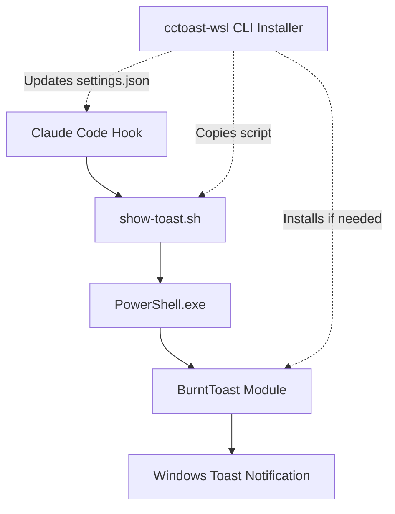

# cctoast-wsl Architecture

## System Overview

**`cctoast-wsl`** bridges the gap between WSL (Windows Subsystem for Linux) and native Windows notifications. It provides a seamless way for Claude Code hooks to trigger Windows toast notifications using the BurntToast PowerShell module.

The architecture follows a simplified 2-layer design:
1. **Install-time layer**: TypeScript CLI tool that sets up the environment
2. **Runtime layer**: Pure Bash script that executes notifications



## Core Design Principles

### 1. Zero Runtime Dependencies
- No Node.js required at runtime
- Direct Bash → PowerShell execution
- Minimal footprint (~30KB installed)
- No wrapper scripts or PATH modifications needed

### 2. Security First
- No elevated privileges required
- Scripts run with user permissions only (0o500)
- No postinstall scripts
- Refuses to run as root
- PowerShell execution policy handled gracefully

### 3. Idempotent Operations
- Re-running installer causes no harm
- JSON merge preserves existing settings
- Atomic file operations prevent corruption
- BurntToast installation is skippable if present

### 4. Cross-Boundary Communication
- WSL → Windows path translation
- Proper escaping for PowerShell
- Timeout protection (10s max)
- Graceful error handling across boundaries

### 5. Simplified Runtime
- Direct script execution from Claude hooks
- No intermediate wrapper layers
- Immediate toast display
- Silent failure mode to avoid interrupting workflows

## Component Architecture

### CLI Installer (TypeScript)
**Location**: `src/cli/`
**Purpose**: One-time installation and configuration
**When it runs**: Only during `npx @claude/cctoast-wsl` or manual installation
**Key Responsibilities**:
- Parse command-line arguments
- Perform dependency checks
- Auto-install BurntToast if needed and user consents
- Merge Claude settings files
- Copy runtime scripts
- Handle uninstallation

```typescript
interface CLIComponents {
  parser: ArgumentParser;
  installer: Installer;
  depChecker: DependencyChecker;
  burntToastInstaller: BurntToastInstaller;
  settingsMerger: SettingsMerger;
  uninstaller: Uninstaller;
}
```

### Bash Script (`show-toast.sh`)
**Location**: `~/.claude/cctoast-wsl/show-toast.sh` (after installation)
**Purpose**: Runtime notification handler
**Execution**: Direct invocation by Claude hooks
**Key Features**:
- Hook mode detection (--notification-hook, --stop-hook)
- Parameter parsing and validation
- WSL → Windows path conversion
- PowerShell invocation with timeout
- Error logging to `~/.claude/cctoast-wsl/toast-error.log`
- Silent failure to avoid disrupting Claude workflows

### PowerShell Integration
**Embedded in**: Bash script as heredoc
**Purpose**: Windows-side notification display
**Components**:
```powershell
param($title, $message, $icon, $log)
try {
    Import-Module BurntToast -ErrorAction Stop
    New-BurntToastNotification -Text $title,$message -AppLogo $icon
} catch {
    $_ | Out-File -Append -FilePath $log
    exit 1
}
```

### BurntToast Auto-Installer
**Location**: `src/installer/burntToast.ts`
**Purpose**: Optional automatic BurntToast installation
**Features**:
- Checks if BurntToast is already installed
- Prompts user for consent before installation
- Runs PowerShell as current user (no elevation)
- Handles execution policy gracefully
- Can be skipped with --skip-burnttoast flag

## Data Flow

### Installation Flow
1. User runs `npx @claude/cctoast-wsl`
2. CLI performs dependency checks
3. If BurntToast missing, offer to install it
4. Interactive prompts for configuration (if TTY)
5. Copy show-toast.sh to `~/.claude/cctoast-wsl/`
6. Set script permissions to 0o500
7. Merge Claude settings with direct script paths
8. Create uninstall manifest

### Runtime Flow
1. Claude Code triggers hook
2. Hook executes `~/.claude/cctoast-wsl/show-toast.sh --notification-hook`
3. Script detects hook mode and sets appropriate defaults
4. Validates WSL environment
5. Converts any paths from WSL to Windows format
6. Executes PowerShell with BurntToast command
7. Toast notification appears on Windows desktop
8. Any errors logged silently to avoid disrupting Claude

## File System Layout

### Installed Files
```
~/.claude/cctoast-wsl/
├── show-toast.sh             # Main notification script
├── assets/
│   └── claude.png            # Default notification icon
├── toast-error.log           # Runtime error log (created on first error)
└── install-manifest.json     # Installation metadata

# Cache directory (separate):
~/.cache/cctoast-wsl/
└── checks.json               # Dependency check cache (24h TTL)
```

### Settings Integration
```
# Global install (default):
~/.claude/
├── settings.json             # Modified with hook paths
└── cctoast-wsl/              # Our installation directory

# Local install:
.claude/
├── settings.local.json       # Modified with hook paths (default)
└── settings.json             # Modified only with --sync flag
```

### Hook Configuration
```json
{
  "hooks": {
    "notification": [
      "/home/user/.claude/cctoast-wsl/show-toast.sh --notification-hook"
    ],
    "stop": [
      "/home/user/.claude/cctoast-wsl/show-toast.sh --stop-hook"
    ]
  }
}
```

## Module Structure

### Core Installer Modules

#### DependencyChecker
**Purpose**: Verify system prerequisites
**Cache**: `~/.cache/cctoast-wsl/checks.json` (24h TTL)
```typescript
interface CheckResult {
  name: string;
  passed: boolean;
  fatal: boolean;
  message?: string;
  remedy?: string;
  timestamp: number;
}

// Checks performed:
const checks = [
  'wsl-environment',      // Fatal: Must be in WSL
  'powershell-exe',       // Fatal: Must have PowerShell access
  'burnttoast-module',    // Fatal: But can auto-install
  'execution-policy',     // Warning: May block PowerShell
  'jq-binary',           // Optional: For advanced features
  'claude-directory'      // Warning: Hooks won't work without it
];
```

#### BurntToastInstaller
**Purpose**: Auto-install BurntToast module
**Features**:
- Check existing installation first
- Prompt for user consent
- Handle execution policy issues
- Install at CurrentUser scope
- Verify installation success

```typescript
interface BurntToastInstaller {
  isInstalled(): Promise<boolean>;
  promptInstall(): Promise<boolean>;
  install(): Promise<void>;
  verify(): Promise<boolean>;
}
```

#### SettingsMerger
**Purpose**: JSONC-aware deep merge
**Features**:
- Preserves comments and formatting
- Array append with deduplication
- Atomic writes with backup
- Type-safe operations
- Direct script path injection

#### Installer
**Purpose**: Simplified file deployment
**Operations**:
1. Create `~/.claude/cctoast-wsl/` directory
2. Copy show-toast.sh with 0o500 permissions
3. Copy assets (claude.png)
4. Create uninstall manifest
5. Inject hook paths into settings

## Error Handling Strategy

### Hierarchical Error Recovery
1. **Fatal Errors** (Exit 2)
   - Missing WSL environment
   - No PowerShell access
   - BurntToast not installed (unless auto-install succeeds)

2. **User Abort** (Exit 1)
   - Cancelled during prompts
   - Declined BurntToast installation
   - Declined confirmation

3. **I/O Errors** (Exit 3)
   - Permission denied
   - Disk full
   - File corruption

4. **Runtime Errors** (Silent)
   - Toast display failures logged
   - Hook continues execution
   - No user interruption
   - Path conversion failures handled gracefully

## Performance Considerations

### Installation Performance
- Target: <30 seconds total (including BurntToast install if needed)
- Dependency checks cached 24h
- Minimal file copying (just one script + icon)
- BurntToast installation adds ~10-15s if needed
- No PATH modifications required

### Runtime Performance  
- Script startup: <50ms (pure bash)
- Toast display: <1 second typical
- PowerShell timeout: 10 seconds max
- No Node.js startup overhead
- Direct execution path
- Silent failures don't block Claude

## Security Model

### Threat Boundaries
1. **WSL → Windows**: Controlled via PowerShell
2. **User → System**: No elevation required
3. **Network**: No network operations
4. **File System**: User-space only

### Mitigations
- Input sanitization for PowerShell
- Path validation and escaping
- No dynamic code execution
- Signed npm packages
- Checksum verification

## Extension Points

### Future Enhancements
1. **Progress Notifications**
   - Use BurntToast UniqueIdentifier
   - Update existing toasts
   - Progress bar support

2. **Custom Backends**
   - Abstract notifier interface at installer level
   - Install different scripts based on platform
   - Support notify-send (Linux native)
   - Support osascript (macOS)

3. **Configuration**
   - User config file `~/.cctoastrc`
   - Per-project overrides
   - Custom sounds and icons
   - Theme support

4. **Advanced Hook Integration**
   - Parse Claude context for richer notifications
   - Task duration tracking
   - Success/failure indicators

### Simplified Architecture Benefits
The 2-layer architecture provides several advantages for future extensions:
- Easy to swap runtime scripts for different platforms
- No complex wrapper maintenance
- Direct execution allows for simple debugging
- Platform-specific optimizations possible
- Minimal runtime dependencies to manage

## Testing Architecture

### Test Layers
1. **Unit Tests**: Individual module testing
2. **Integration Tests**: Module interaction
3. **E2E Tests**: Full installation flow
4. **Shell Tests**: Bash script validation
5. **Mock Tests**: PowerShell simulation

### Coverage Strategy
- Core modules: 100% coverage
- CLI commands: 85% branch coverage
- Error paths: Explicit test cases
- Edge cases: Timeout, permissions, etc.

## Build Pipeline

### Development Build
```bash
npm run build:dev
# Fast builds with source maps
# No minification
# Watch mode available
```

### Production Build
```bash
npm run build
# Minified output
# Tree shaking
# < 100KB bundle size
```

### Release Process
1. Conventional commit triggers version bump
2. CI runs full test suite
3. Build artifacts generated
4. npm package published with provenance
5. GitHub release created
6. Documentation site updated

## Monitoring & Diagnostics

### Error Logging
- Location: `~/.claude/cctoast-wsl/toast-error.log`
- Rotation: Manual (future: automatic)
- Format: `[ISO-8601 timestamp] ERROR: message`
- Only created on first error (not pre-created)

### Debug Mode
```bash
# Runtime debugging
CCTOAST_DEBUG=1 ~/.claude/cctoast-wsl/show-toast.sh --notification-hook
# Shows PowerShell output
# Logs all parameters
# Timing information

# Installation debugging
CCTOAST_DEBUG=1 npx @claude/cctoast-wsl
# Verbose dependency checks
# Detailed merge operations
# File operation logging
```

### Health Checks
```bash
# Built into installer
npx @claude/cctoast-wsl --check
# Verify all dependencies
# Test notification display
# Report system info

# Manual runtime test
~/.claude/cctoast-wsl/show-toast.sh --test
# Sends test notification
# Reports success/failure
```

## Compatibility Matrix

### Supported Environments
| Component | Minimum | Recommended | Notes |
|-----------|---------|-------------|-------|
| Node.js | 18.0.0 | 20.x | Install time only |
| WSL | 1 | 2 | Better performance in WSL2 |
| Windows | 10 1903 | 11 | BurntToast requirement |
| PowerShell | 5.1 | 7.x | Windows PowerShell works |
| Claude Code | Any | Latest | Hook support required |

### Known Limitations
1. Windows-only notifications (by design)
2. No notification history
3. Limited customization without modifying script
4. No notification callbacks/interactions
5. Single notification at a time (no queueing)

## Maintenance Guidelines

### Code Organization
- Single responsibility per module
- Clear interfaces between layers
- Minimal external dependencies
- Comprehensive error messages

### Documentation Requirements
- JSDoc for all public APIs
- README for each major component
- Architecture decision records
- Changelog maintenance

### Performance Budget
- CLI startup: <100ms
- Install time: <30s (45s with BurntToast)
- Runtime overhead: <50ms (bash script)
- Toast display: <1s typical
- Memory usage: <10MB runtime, <50MB install

## Architecture Decisions

### Why 2-Layer Architecture?
The decision to use a simplified 2-layer architecture (installer + runtime script) instead of a 3-layer approach (installer + wrapper + script) was made for several key reasons:

1. **Simplicity**: Direct script execution is easier to understand and debug
2. **Performance**: Eliminates wrapper overhead, reducing startup time
3. **Reliability**: Fewer moving parts means fewer failure points
4. **Maintenance**: Single script is easier to update and test
5. **Security**: No PATH modifications reduce attack surface

### Direct Script Path Benefits
Using absolute paths to the script in Claude hooks provides:
- No PATH pollution or conflicts
- Clear visibility of what's being executed
- Easy manual testing and debugging
- No ambiguity about which version is running
- Simple uninstallation (just remove directory)

### Trade-offs Accepted
- Users see full paths in settings (acceptable for transparency)
- No "cctoast-wsl" command in PATH (not needed for hook use case)
- Script location is fixed after installation (reasonable constraint)