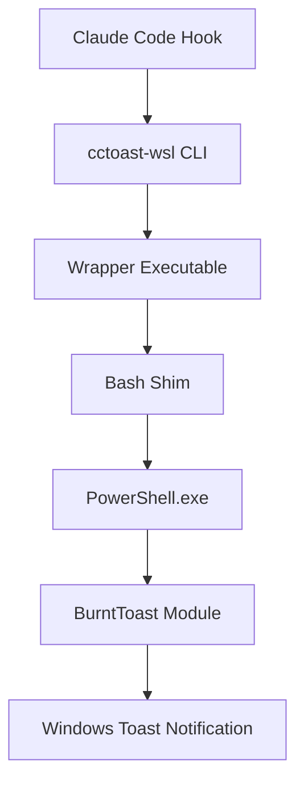

# cctoast-wsl Architecture

## System Overview

**`cctoast-wsl`** bridges the gap between WSL (Windows Subsystem for Linux) and native Windows notifications. It provides a seamless way for Claude Code hooks to trigger Windows toast notifications using the BurntToast PowerShell module.



## Core Design Principles

### 1. Zero Runtime Dependencies
- No Node.js required at runtime
- Pure Bash → PowerShell execution path
- Minimal footprint (~50KB installed)

### 2. Security First
- No elevated privileges required
- Scripts run with user permissions only (0o500)
- No postinstall scripts
- Refuses to run as root

### 3. Idempotent Operations
- Re-running installer causes no harm
- JSON merge preserves existing settings
- Atomic file operations prevent corruption

### 4. Cross-Boundary Communication
- WSL → Windows path translation
- Proper escaping for PowerShell
- Timeout protection (10s max)

## Component Architecture

### CLI Tool (TypeScript)
**Location**: `src/cli/`
**Purpose**: Installation and configuration management
**Key Responsibilities**:
- Parse command-line arguments
- Perform dependency checks
- Merge Claude settings files
- Copy runtime scripts
- Handle uninstallation

```typescript
interface CLIComponents {
  parser: ArgumentParser;
  installer: Installer;
  depChecker: DependencyChecker;
  settingsMerger: SettingsMerger;
  uninstaller: Uninstaller;
}
```

### Wrapper Executable
**Location**: `~/.claude/cctoast-wsl/bin/cctoast-wsl`
**Purpose**: Entry point for hook execution
**Implementation**: Symlink to main script with PATH integration

### Bash Shim (`show-toast.sh`)
**Location**: `scripts/show-toast.sh`
**Purpose**: WSL-side orchestration
**Key Features**:
- Parameter parsing and validation
- WSL → Windows path conversion
- PowerShell invocation with timeout
- Error logging to `~/.claude/cctoast-wsl/toast-error.log`

### PowerShell Integration
**Embedded in**: Bash shim
**Purpose**: Windows-side notification display
**Components**:
```powershell
param($title, $message, $icon, $log)
Import-Module BurntToast -ErrorAction Stop
New-BurntToastNotification -Text $title,$message -AppLogo $icon
```

## Data Flow

### Installation Flow
1. User runs `npx @claude/cctoast-wsl`
2. CLI performs dependency checks
3. Interactive prompts (if TTY)
4. Files copied to installation directory
5. Claude settings merged atomically
6. PATH updated (global install only)

### Runtime Flow
1. Claude Code triggers hook
2. Hook executes `cctoast-wsl --notification-hook`
3. Wrapper delegates to bash shim
4. Shim validates environment and parameters
5. PowerShell script executed with timeout
6. BurntToast displays notification
7. Errors logged silently

## File System Layout

### Installed Files
```
~/.claude/cctoast-wsl/
├── bin/
│   └── cctoast-wsl          # Wrapper executable
├── scripts/
│   ├── show-toast.sh         # Main notification script
│   ├── path-helper.sh        # Path conversion utilities
│   └── uninstall.sh          # Cleanup script
├── assets/
│   └── claude.png            # Default notification icon
├── toast-error.log           # Runtime error log
└── install-manifest.json     # Installation metadata
```

### Settings Integration
```
~/.claude/
├── settings.json             # Global settings (modified)
└── cctoast-wsl/              # Our installation directory

# OR for local install:
.claude/
├── settings.local.json       # Local settings (default)
└── settings.json             # Tracked settings (--sync only)
```

## Module Structure

### Core Modules

#### DependencyChecker
**Purpose**: Verify system prerequisites
**Cache**: `~/.cache/cctoast-wsl/checks.json` (24h TTL)
```typescript
interface CheckResult {
  name: string;
  passed: boolean;
  fatal: boolean;
  message?: string;
  timestamp: number;
}
```

#### SettingsMerger
**Purpose**: JSONC-aware deep merge
**Features**:
- Preserves comments
- Array deduplication
- Atomic writes with backup
- Type-safe operations

#### Installer
**Purpose**: File copying and PATH management
**Operations**:
1. Create directory structure
2. Copy scripts with permissions
3. Update shell profiles
4. Create uninstall manifest

## Error Handling Strategy

### Hierarchical Error Recovery
1. **Fatal Errors** (Exit 2)
   - Missing WSL environment
   - No PowerShell access
   - BurntToast not installed

2. **User Abort** (Exit 1)
   - Cancelled during prompts
   - Declined confirmation

3. **I/O Errors** (Exit 3)
   - Permission denied
   - Disk full
   - File corruption

4. **Runtime Errors** (Silent)
   - Toast display failures logged
   - Hook continues execution
   - No user interruption

## Performance Considerations

### Installation Performance
- Target: <30 seconds total
- Dependency checks cached 24h
- Parallel file operations where possible
- Minimal network I/O

### Runtime Performance  
- Hook execution: <2 seconds
- PowerShell timeout: 10 seconds max
- No blocking operations
- Async error logging

## Security Model

### Threat Boundaries
1. **WSL → Windows**: Controlled via PowerShell
2. **User → System**: No elevation required
3. **Network**: No network operations
4. **File System**: User-space only

### Mitigations
- Input sanitization for PowerShell
- Path validation and escaping
- No dynamic code execution
- Signed npm packages
- Checksum verification

## Extension Points

### Future Enhancements
1. **Progress Notifications**
   - Use BurntToast UniqueIdentifier
   - Update existing toasts

2. **Custom Backends**
   - Abstract notifier interface
   - Support notify-send (Linux)
   - Support osascript (macOS)

3. **Configuration**
   - User preferences file
   - Per-project overrides
   - Theme support

### Plugin Architecture (Future)
```typescript
interface NotificationBackend {
  name: string;
  check(): Promise<boolean>;
  notify(options: NotifyOptions): Promise<void>;
}
```

## Testing Architecture

### Test Layers
1. **Unit Tests**: Individual module testing
2. **Integration Tests**: Module interaction
3. **E2E Tests**: Full installation flow
4. **Shell Tests**: Bash script validation
5. **Mock Tests**: PowerShell simulation

### Coverage Strategy
- Core modules: 100% coverage
- CLI commands: 85% branch coverage
- Error paths: Explicit test cases
- Edge cases: Timeout, permissions, etc.

## Build Pipeline

### Development Build
```bash
npm run build:dev
# Fast builds with source maps
# No minification
# Watch mode available
```

### Production Build
```bash
npm run build
# Minified output
# Tree shaking
# < 100KB bundle size
```

### Release Process
1. Conventional commit triggers version bump
2. CI runs full test suite
3. Build artifacts generated
4. npm package published with provenance
5. GitHub release created
6. Documentation site updated

## Monitoring & Diagnostics

### Error Logging
- Location: `~/.claude/cctoast-wsl/toast-error.log`
- Rotation: Manual (future: automatic)
- Format: Timestamp | Level | Message

### Debug Mode (Future)
```bash
CCTOAST_DEBUG=1 cctoast-wsl --notification-hook
# Verbose logging
# Performance timing
# PowerShell output capture
```

### Health Checks
```bash
cctoast-wsl --check
# Verify all dependencies
# Test notification display
# Report system info
```

## Compatibility Matrix

### Supported Environments
| Component | Minimum | Recommended | Notes |
|-----------|---------|-------------|-------|
| Node.js | 18.0.0 | 20.x | Install time only |
| WSL | 1 | 2 | Better performance in WSL2 |
| Windows | 10 1903 | 11 | BurntToast requirement |
| PowerShell | 5.1 | 7.x | Windows PowerShell works |
| Claude Code | Any | Latest | Hook support required |

### Known Limitations
1. Windows-only notifications
2. Requires BurntToast pre-installed
3. No notification history
4. Limited customization options
5. No notification callbacks

## Maintenance Guidelines

### Code Organization
- Single responsibility per module
- Clear interfaces between layers
- Minimal external dependencies
- Comprehensive error messages

### Documentation Requirements
- JSDoc for all public APIs
- README for each major component
- Architecture decision records
- Changelog maintenance

### Performance Budget
- CLI startup: <100ms
- Install time: <30s
- Runtime overhead: <50ms
- Memory usage: <50MB