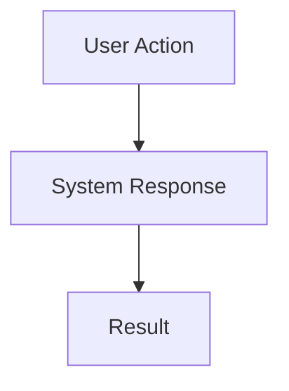

# Documentation Style Guide

This guide ensures consistency across all cctoast-wsl documentation and provides best practices for creating engaging, readable content.

## Audience-Specific Guidelines

### For Human Readers
> [!IMPORTANT]  
> Human-facing documentation should be **visual, scannable, and engaging** for short attention spans.

- **Keep it tight**: Short paragraphs, bullet points, clear headings
- **Make it visual**: Use diagrams, tables, code blocks, and formatting
- **Stay interesting**: Avoid walls of text, use varied formatting
- **Be scannable**: Headers, bullets, callouts, and white space
- **Show, don't tell**: Prefer examples over explanations

### For LLM/agent Readers (CLAUDE.md, Technical Specs)
- **Be comprehensive**: Include all critical implementation details
- **Stay factual**: No marketing language, just specifications
- **Be specific**: Exact file paths, complete API references
- **Focus on context**: What the LLM needs to understand to work effectively

> [!NOTE]  
> For comprehensive LLM documentation guidance, see [WRITING_DOCS_FOR_AI.md](WRITING_DOCS_FOR_AI.md)


## Markdown Formatting Techniques

### Visual Elements

#### Alerts and Callouts
```markdown
> [!NOTE]  
> General information or tips

> [!IMPORTANT]  
> Critical information users must know

> [!WARNING]  
> Potential risks or security considerations

> [!TIP]  
> Helpful suggestions or shortcuts
```

#### Code Blocks with Context
```markdown
# Always specify language and add context
```bash
# Install dependencies (takes ~2 minutes)
npm install
```

```json
// ~/.claude/settings.json
{
  "hooks": {
    "notification": ["~/.claude/hooks/show-toast.sh --notification-hook"]
  }
}
```
```

#### Tables for Scannable Information
```markdown
| Flag | Default | Description |
|------|---------|-------------|
| `--global` | ✓ | Install globally |
| `--local` | | Project-specific install |
| `--dry-run` | | Preview changes only |
```

#### Collapsible Sections
```markdown
<details>
<summary>Advanced Configuration Options</summary>

Content that doesn't need to be immediately visible but provides depth for interested users.

</details>
```

### Images and Diagrams

#### Screenshots and GIFs
```markdown

*Figure 1: One-click installation process*
```

#### Mermaid Diagrams
```markdown

```

### Structure Patterns

#### Quick Start Format
```markdown
## Quick Start

1. **Install**: `npx @claudes-world/cctoast-wsl`
2. **Test**: Hook automatically triggers on Claude activity
3. **Done**: Toast notifications now work in WSL

> [!TIP]  
> Installation takes under 30 seconds
```

#### Problem-Solution Pattern
```markdown
### Problem
Clear statement of the issue

### Solution
Step-by-step resolution

### Verification
How to confirm it worked
```

## Content Guidelines

### Headings
- Use sentence case: "Getting started" not "Getting Started"
- Be descriptive: "Manual installation steps" not "Manual"
- Keep parallel structure in lists

### Code Examples
- Always test code examples before publishing
- Include expected output when helpful
- Add comments explaining non-obvious parts
- Use realistic paths and examples

### Links and References
```markdown
- **Internal links**: Use relative paths `[Architecture](docs/ai_docx/ARCHITECTURE.md)`
- **External links**: Open in new tab when appropriate
- **Reference-style**: For repeated links use `[text][ref]` format
```

### Security Content
> [!WARNING]  
> Always explain security implications clearly

```markdown
**Security Note**: Script files in project directories can be modified by prompt injection attacks. Always place executable hooks outside the project directory.
```

## Document-Specific Guidelines

### README.md
- **Hero section**: Clear value proposition with demo
- **Quick start**: Get users to success in under 2 minutes
- **Visual flow**: Diagram → Installation → Links to deeper docs
- **Scannable**: Use tables, bullets, and code blocks liberally

### Architecture Documentation
- **Diagrams first**: Visual representation before text explanation
- **Layer by layer**: Start high-level, drill down to details
- **Decision records**: Explain why choices were made

### API Documentation
- **Examples first**: Show usage before explaining parameters
- **Complete**: Every parameter documented
- **Error cases**: Document failure modes and solutions

### Troubleshooting Guides
- **Problem-first**: Lead with the error or symptom
- **Step-by-step**: Clear numbered resolution steps
- **Verification**: How to confirm the fix worked

## Formatting Checklist

### Before Publishing
- [ ] Headings follow consistent capitalization
- [ ] Code blocks specify language
- [ ] Images have alt text and captions
- [ ] Tables are properly formatted
- [ ] Links are tested and work
- [ ] Alerts highlight important information
- [ ] Content is scannable (not walls of text)
- [ ] Examples are realistic and tested

### Visual Appeal
- [ ] Varied formatting (not just paragraphs)
- [ ] Appropriate use of **bold** and *italic*
- [ ] Code blocks break up text
- [ ] Tables for comparison data
- [ ] Diagrams for complex concepts
- [ ] Callouts for important notes

## Tools and Resources

### Markdown Editors
- VS Code with Markdown Preview Enhanced
- Typora for WYSIWYG editing
- GitHub's web editor for quick changes

### Validation
- Markdownlint for style consistency
- Link checkers for broken links
- Spell checkers with technical dictionaries

### Inspiration
- Study well-designed project READMEs
- GitHub's own documentation style
- Popular CLI tool documentation (e.g., Git, Docker)

---

> [!NOTE]  
> This guide evolves with the project. Update it when establishing new patterns or discovering better practices.