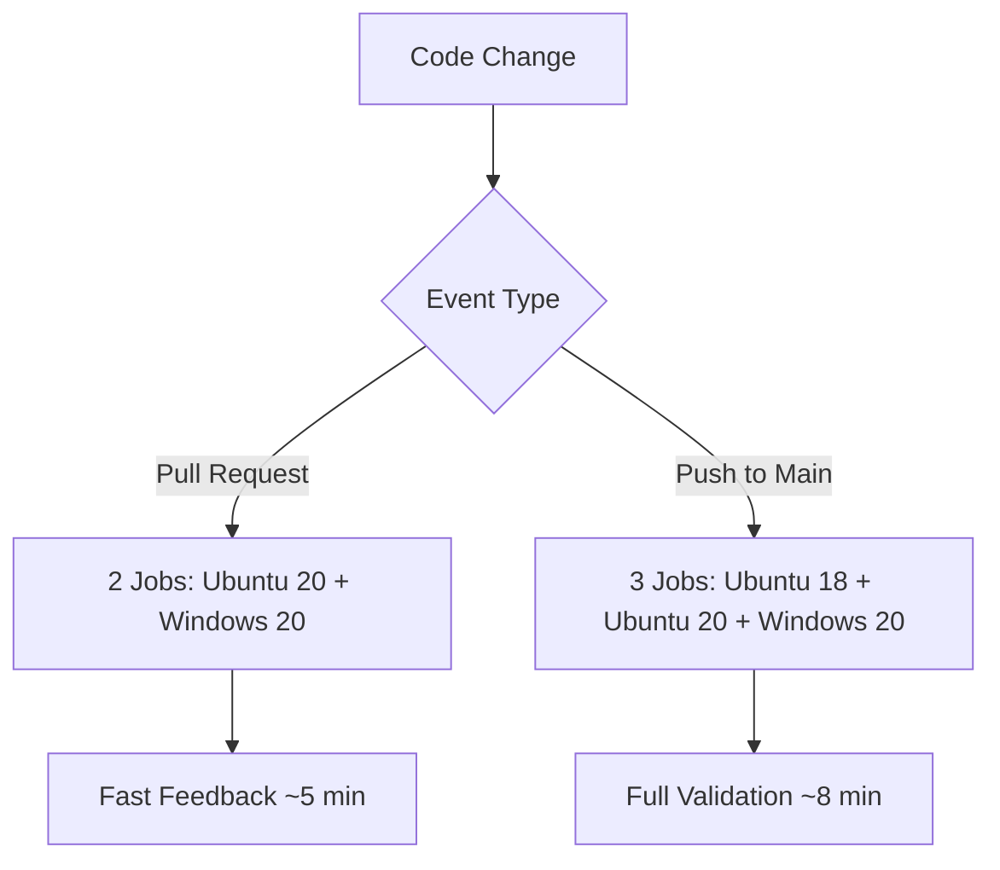

# CI/CD Workflows Guide

This guide explains the optimized CI/CD workflows for cctoast-wsl, designed to reduce GitHub Actions minutes usage while maintaining code quality and compatibility standards.

## 🎯 Overview

The cctoast-wsl project uses **4 optimized GitHub Actions workflows** that work together to provide fast feedback for development while ensuring thorough testing for releases:

| Workflow | Purpose | Trigger | Optimization Level |
|----------|---------|---------|-------------------|
| **CI** | Build, test, lint | Push/PR to main | High - Smart matrix |
| **Release Please** | Version management | Push to main | Medium - Path filtered |
| **Release** | Publish packages | Version tags | Low - Full validation |
| **Claude Code** | AI assistance & reviews | @claude mentions | High - Unified triggers |

## 📊 Optimization Results

**Before Optimization**: ~15-20 CI minutes per typical development cycle
**After Optimization**: ~3-5 CI minutes per typical development cycle
**Savings**: **70-85% reduction** in GitHub Actions usage

## 🚀 Core Optimizations

### 1. Path-Based Filtering

Workflows only run when relevant files change, not on documentation updates.

#### CI Workflow Triggers
```yaml
paths:
  - 'src/**'           # TypeScript source code
  - 'scripts/**'       # Bash scripts
  - 'package*.json'    # Dependencies
  - 'tsconfig.json'    # TypeScript config
  - '__tests__/**'     # Test files
  - '.github/workflows/ci.yml'  # Workflow itself
```

#### What This Means
✅ **Runs CI when**: Changing code, tests, dependencies, or build config
❌ **Skips CI when**: Updating README, docs, or non-functional files

### 2. Smart Matrix Strategy

Different testing strategies for different scenarios:

#### Pull Requests (Fast Feedback)
- **Jobs**: 2 (Ubuntu 20 + Windows 20)
- **Node versions**: 18.x, 20.x (Windows only 20.x)
- **Purpose**: Quick validation for development

#### Main Branch Pushes (Full Validation)
- **Jobs**: 3 (Ubuntu 18 + Ubuntu 20 + Windows 20)  
- **Node versions**: 18.x, 20.x (Windows only 20.x)
- **Purpose**: Complete compatibility testing



### 3. Conditional Job Execution

Expensive operations only run when necessary:

- **Benchmarks**: Only on main branch pushes (not PRs)
- **Coverage Upload**: Only on Ubuntu 20 + Node 20 combination
- **Shell Tests**: Only on Ubuntu (not Windows)

### 4. Enhanced Caching

Aggressive caching reduces build times:

```yaml
# Build outputs cached across runs
- bin/
- coverage/
- .esbuild/

# Tools cached (Ubuntu only)  
- ~/.local/bin
- /usr/local/bin/bats
```

## 🏷️ Workflow Control Flags

Use special flags to control workflow execution:

### Skip CI: `[skip-ci]`

Add to commit messages to bypass CI and Release Please workflows:

```bash
# Documentation changes
git commit -m "docs: update installation guide [skip-ci]"

# Configuration changes
git commit -m "chore: update eslint config [skip-ci]"

# IDE settings
git commit -m "chore: add vscode settings [skip-ci]"
```

### Request Claude Review: `@claude review`

Claude Code Review is now integrated into the main Claude workflow and only runs when explicitly requested:

```bash
# Request a review by commenting on a PR
gh pr comment <pr-number> --body "@claude review this PR please"

# Alternative polite form
gh pr comment <pr-number> --body "@claude please review - focus on security"

# Or comment directly in the GitHub UI
# "@claude review - focus on security and performance"
```

**Note**: Reviews use the same unified workflow as general Claude interactions, with intelligent detection of review requests.

## 📋 Workflow Details

### CI Workflow (`ci.yml`)

**Triggers**:
- Push to main (with path filtering)
- Pull requests to main (with path filtering)
- Manual dispatch

**Jobs**:
1. **Test & Build** (Matrix job)
   - Type checking with TypeScript
   - Linting (ESLint + ShellCheck)  
   - Unit tests with coverage
   - Production build
   - Bundle size verification

2. **Benchmark** (Conditional)
   - Build time measurement (<1s target)
   - CLI startup time (<100ms target)
   - Only runs on main branch pushes

**Skip Conditions**:
- Commit message contains `[skip-ci]`
- Only documentation files changed
- Bot commits (automated)

### Release Please Workflow (`release-please.yml`)

**Purpose**: Automated version management and changelog generation

**Triggers**:
- Push to main (with path filtering)
- Only when code actually changes

**Features**:
- Creates release PRs automatically
- Updates version numbers
- Generates changelogs from conventional commits
- Auto-merges when CI passes

### Claude Workflow

#### Claude Code (`claude.yml`) - Unified Workflow
**Major Update**: Consolidated three separate Claude workflows into a single unified workflow, eliminating 95% code duplication while maintaining all functionality.

**Key Features**:
- **Unified triggers**: Handles both general @claude interactions and code reviews
- **Intelligent detection**: Automatically determines if `@claude review` was requested
- **Security controls**: Consistent user authorization across all interactions
- **Manual reviews only**: Code reviews only run when explicitly requested to save CI minutes
- **Backward compatible**: All existing `@claude` usage patterns work unchanged

**Optimizations**:
- Single workflow eliminates maintenance overhead of multiple files
- Smart branching logic for different interaction types
- Prevents trigger conflicts and edge cases
- Reduces skipped workflow runs through better conditions

**Interaction Types**:
1. **General assistance**: `@claude` in issues, comments, reviews
2. **Code reviews**: `@claude review` or `@claude please review` in PR contexts

**Benefits of Consolidation**:
- ✅ Single source of truth for maintenance
- ✅ Consistent security model across all Claude features  
- ✅ Eliminates potential conflicts between workflows
- ✅ Simplified debugging and monitoring

## 🛠️ Best Practices

### For Developers

#### Use Skip Flags Appropriately
```bash
# ✅ Good uses of [skip-ci]
git commit -m "docs: update FAQ [skip-ci]"
git commit -m "chore: update .gitignore [skip-ci]"
git commit -m "style: fix markdown formatting [skip-ci]"

# ❌ Avoid [skip-ci] for
git commit -m "fix: important bug fix [skip-ci]"  # Should be tested!
git commit -m "feat: new feature [skip-ci]"       # Needs full CI!
```

#### Optimize Your Development Workflow
1. **Draft PRs**: Use draft PRs to avoid triggering reviews prematurely
2. **Batch commits**: Group related changes to reduce CI runs
3. **Path awareness**: Understand which files trigger which workflows

### For Maintainers

#### Monitor CI Usage
```bash
# Check recent workflow runs
gh run list --limit 20

# View workflow statistics
gh api repos/:owner/:repo/actions/workflows/:workflow_id/runs --jq '.workflow_runs | length'
```

#### Adjust Thresholds
The workflows include configurable thresholds:
- **Coverage**: 90% lines, 85% branches  
- **Bundle size**: <100KB
- **Build time**: <1 second

## 🐛 Troubleshooting

### Common Issues

#### "CI didn't run on my PR"
**Cause**: Path filtering excluded your changes
**Solution**: Check if you only modified docs/config files
```bash
# Force CI run by touching a source file
touch src/cli.ts && git add . && git commit --amend --no-edit
```

#### "Tests failed on Ubuntu 18 but not Ubuntu 20"
**Cause**: Node.js version compatibility issue
**Solution**: Ubuntu 18 only runs on main branch for compatibility checks
- Fix compatibility issues before merging
- Consider updating minimum Node.js version

#### "Claude Code Review didn't trigger"
**Cause**: Reviews are now manual-only and integrated into the unified Claude workflow
**Solution**: Request a review by commenting `@claude review` or `@claude please review` on the PR
**Note**: This is intentional to save CI minutes - reviews only run when explicitly requested

#### "Benchmarks are missing from PR"
**Expected**: Benchmarks only run on main branch pushes to save CI minutes
**Action**: Performance validation happens after merge, not during PR

### Debug Commands

```bash
# Check which files would trigger CI
git diff --name-only origin/main | grep -E "(src/|scripts/|package.*\.json|tsconfig\.json|__tests__/|\.github/workflows/ci\.yml)"

# Test path filtering locally
act -j test --dryrun  # Requires nektos/act

# View workflow run details
gh run view <run-id> --log
```

## 📈 Monitoring & Metrics

### Key Metrics to Track

1. **CI Minutes Usage**
   - Target: <100 minutes/week for active development
   - Baseline: ~300 minutes/week before optimization

2. **Developer Experience**
   - PR feedback time: <5 minutes average
   - Failed builds: <10% of total runs

3. **Quality Gates**
   - Test coverage: Maintained at 90%+
   - Build success rate: >95% on main branch

### Usage Dashboard

Monitor CI usage in GitHub repository settings:
- **Actions** → **Usage** → View detailed metrics
- Track minutes by workflow
- Identify optimization opportunities

## 🔧 Advanced Configuration

### Custom Path Filters

To add new paths that should trigger CI:

```yaml
# In .github/workflows/ci.yml
paths:
  - 'src/**'
  - 'scripts/**'
  - 'your-new-path/**'  # Add here
```

### Matrix Customization

To modify the test matrix:

```yaml
# Different matrix for different events
os: ${{ github.event_name == 'pull_request' && fromJSON('["ubuntu-latest", "windows-latest"]') || fromJSON('["ubuntu-18.04", "ubuntu-latest", "windows-latest"]') }}
```

### Cache Configuration

Customize caching behavior:

```yaml
# Extend cache paths
path: |
  bin/
  coverage/
  .esbuild/
  your-cache-dir/  # Add custom paths

# Modify cache keys  
key: ${{ runner.os }}-build-${{ matrix.node-version }}-${{ hashFiles('package*.json', 'src/**') }}
```

## 🚀 Future Improvements

### Planned Optimizations

1. **Dependency Caching**: Cross-workflow cache sharing
2. **Test Sharding**: Parallel test execution for large test suites
3. **Smart Rebuilds**: Only rebuild changed modules
4. **Preview Deployments**: Conditional deployment for PRs

### Contributing Improvements

To suggest CI/CD improvements:

1. **Create an issue** with the `ci/cd` label
2. **Benchmark current performance** before/after changes
3. **Test thoroughly** with path filtering and matrix strategies
4. **Document changes** in this guide

---

## 📚 Related Documentation

- [Developer Workflow Guide](../ai_docx/DEVELOPER_WORKFLOW.md) - Full development process
- [Project Management Guide](../ai_docx/PROJECT_MANAGEMENT.md) - Issue and PR workflows  
- [Architecture Overview](../ai_docx/ARCHITECTURE.md) - Technical design decisions

---

> **💡 Pro Tip**: The CI optimizations save significant GitHub Actions minutes while maintaining code quality. Use skip flags wisely, understand path filtering, and monitor your usage to get the most benefit from these optimizations!