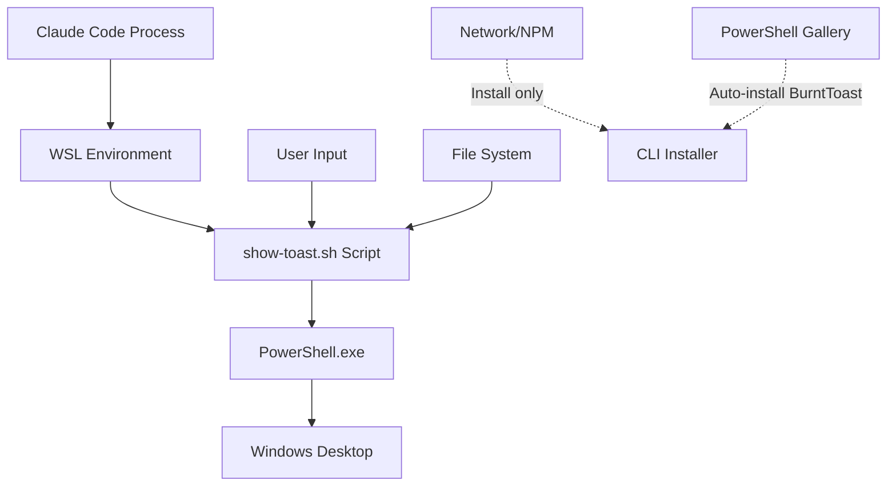

# Security Guide

This document outlines the security considerations, threat model, and best practices for cctoast-wsl. Understanding these aspects is crucial for safe deployment in any environment.

## Security Overview

cctoast-wsl is designed with **security-first principles**:
- **No elevated privileges** required
- **User-scope installation** only
- **Minimal attack surface** through direct script execution
- **Input sanitization** for cross-boundary operations
- **No network operations** during runtime

> [!IMPORTANT]  
> cctoast-wsl specifically **refuses to run as root** and requires no system-level modifications

## Threat Model

### Trust Boundaries

The cctoast-wsl system operates across several trust boundaries:



#### 1. WSL → Windows Boundary
- **Risk**: Command injection via PowerShell execution
- **Mitigation**: Input sanitization and parameter escaping
- **Boundary Control**: PowerShell execution with fixed command structure

#### 2. User → System Boundary  
- **Risk**: Privilege escalation attempts
- **Mitigation**: User-scope installation only, no sudo usage
- **Boundary Control**: File permissions (0o500) and user-only module installation

#### 3. Process → File System Boundary
- **Risk**: Unauthorized file access or modification
- **Mitigation**: Restricted file permissions and explicit path validation
- **Boundary Control**: Installation outside project directories

#### 4. Network → Local System Boundary
- **Risk**: Supply chain attacks via npm or PowerShell Gallery
- **Mitigation**: Package signatures, checksums, and provenance
- **Boundary Control**: HTTPS-only downloads and verified sources

#### 5. PowerShell Gallery → Local System Boundary
- **Risk**: Compromised BurntToast module during auto-installation
- **Mitigation**: User consent required, CurrentUser scope only, official PowerShell Gallery
- **Boundary Control**: No elevated privileges, user can decline auto-installation

### Attack Vectors and Mitigations

#### Command Injection
**Vector**: Malicious input passed to PowerShell execution
```bash
# Vulnerable (example of what we prevent):
powershell.exe -Command "Show-Toast '$USER_INPUT'"

# Secure (our implementation):
powershell.exe -Command "$SANITIZED_SCRIPT" -title "$ESCAPED_TITLE" -message "$ESCAPED_MESSAGE"
```

**Mitigations**:
- Parameter binding instead of string concatenation
- Input validation and character escaping
- Fixed PowerShell script structure
- No dynamic command construction

#### Privilege Escalation
**Vector**: Attempts to gain system-level access
**Mitigations**:
- Explicit root user detection and refusal
- User-scope PowerShell module installation
- No postinstall scripts in package.json
- File permissions restricted to user only (0o500)

#### Path Traversal  
**Vector**: Malicious file paths in image or script parameters
```bash
# Attack attempt:
show-toast.sh --image "../../../../etc/passwd"

# Protection:
- Absolute path validation
- WSL path conversion verification
- File existence checks before usage
```

#### Supply Chain Attacks
**Vector**: Compromised npm packages or PowerShell modules
**Mitigations**:
- Package signatures and provenance
- SHA-256 checksums for manual installation
- Minimal dependencies
- BurntToast from official PowerShell Gallery only

#### BurntToast Auto-Installation
**Vector**: Malicious PowerShell module installed during auto-installation
**Mitigations**:
- Explicit user consent required before installation
- CurrentUser scope only (no system-wide installation)
- Official PowerShell Gallery as only source
- User can decline and install manually
- No elevated privileges during installation
```bash
# Auto-installation command (user scope only):
Install-Module BurntToast -Scope CurrentUser -Force
```

#### Prompt Injection via Claude Code
**Vector**: Malicious prompts causing code modification in project directories
**Mitigations**:
- Installation **outside** project directories (`~/.claude/cctoast-wsl/`)
- Read-only script permissions
- No dynamic code execution
- Fixed hook command paths

## Security Architecture

### File System Security

#### Installation Locations
```bash
# Secure (recommended):
~/.claude/cctoast-wsl/show-toast.sh     # Outside project reach
/opt/cctoast-wsl/show-toast.sh          # System-wide (manual install)

# Insecure (avoided):
./project/.claude/hooks/show-toast.sh   # Project directory - prompt injection risk
/tmp/show-toast.sh                      # Temporary location - persistence issues
```

#### File Permissions
```bash
# Script permissions (0o500):
-r-x------  show-toast.sh               # User execute only, no write access
-r--------  claude.png                  # User read only

# Directory permissions:
drwx------  ~/.claude/cctoast-wsl/      # User access only
```

### PowerShell Security

#### Execution Policy Handling
```powershell
# Current user scope only (no admin required):
Set-ExecutionPolicy -Scope CurrentUser RemoteSigned

# Never system-wide or with elevated privileges:
# Set-ExecutionPolicy -Scope LocalMachine RemoteSigned  # ❌ Avoid
```

#### Module Installation Security
```powershell
# Auto-installation (user consent required):
# Performed by CLI installer with user prompt

# Secure user-scope installation:
Install-Module BurntToast -Scope CurrentUser -Force

# Never system-wide (avoided):
# Install-Module BurntToast -Scope AllUsers  # ❌ Requires elevation

# Verification before use:
Import-Module BurntToast -ErrorAction Stop
```

#### Script Execution Security
```powershell
# Secure parameter binding:
param($title, $message, $icon, $log)
New-BurntToastNotification -Text $title,$message -AppLogo $icon

# Insecure string interpolation (avoided):
# Invoke-Expression "New-BurntToastNotification -Text '$title','$message'"
```

### Network Security

#### Installation Sources
```bash
# Trusted sources only:
https://registry.npmjs.org/@claude/cctoast-wsl    # Official npm registry
https://github.com/claudes-world/cctoast-wsl      # Official repository
https://www.powershellgallery.com/packages/BurntToast  # Official PowerShell Gallery

# Package verification:
npm audit @claude/cctoast-wsl
npm verify @claude/cctoast-wsl
```

#### No Runtime Network Operations
- Scripts operate entirely offline after installation
- No telemetry or phone-home functionality
- No automatic updates or remote configuration

## Best Practices

### For Users

#### Installation Security
```bash
# ✅ Recommended installation:
npx @claude/cctoast-wsl --global

# ✅ Allow BurntToast auto-installation when prompted:
# Installer will ask: "Install BurntToast module? [y/N]"
# Answer 'y' for automatic user-scope installation

# ✅ Verify package before installation:
npm info @claude/cctoast-wsl

# ❌ Avoid these patterns:
sudo npx @claude/cctoast-wsl           # Never use sudo
npx @claude/cctoast-wsl --local --sync # Avoid sync in shared projects
```

#### Operational Security
```bash
# ✅ Secure hook configuration:
{
  "hooks": {
    "notification": ["/home/user/.claude/cctoast-wsl/show-toast.sh --notification-hook"]
  }
}

# ❌ Insecure patterns:
{
  "hooks": {
    "notification": ["./project-hooks/show-toast.sh --notification-hook"]  # Project directory risk
  }
}
```

#### File System Security
```bash
# ✅ Verify permissions:
ls -la ~/.claude/cctoast-wsl/show-toast.sh
# Should show: -r-x------ (500 permissions)

# ✅ Regular security checks:
find ~/.claude/cctoast-wsl -type f -perm -o+w
# Should return no results (no world-writable files)
```

### For Developers

#### Secure Development
```bash
# Input validation example:
validate_title() {
    local title="$1"
    # Remove or escape PowerShell special characters
    title="${title//\$/\\\$}"      # Escape dollar signs
    title="${title//\`/\\\`}"      # Escape backticks
    title="${title//\"/\\\"}"      # Escape quotes
    echo "$title"
}
```

#### Testing Security
```bash
# Test with malicious inputs:
./show-toast.sh --title "\$(Get-Process)" --message "Injection test"
./show-toast.sh --title "\`Get-Process\`" --message "Command substitution test"

# Verify no command execution occurs
```

#### Code Review Checklist
- [ ] No dynamic command construction
- [ ] All user inputs validated and escaped
- [ ] No elevated privileges required
- [ ] File permissions properly restricted
- [ ] No secrets or credentials in code
- [ ] Error messages don't reveal sensitive information

### For Administrators

#### Enterprise Deployment
```bash
# Centralized installation verification:
for user in $(ls /home/); do
    echo "Checking $user..."
    sudo -u "$user" ls -la "/home/$user/.claude/cctoast-wsl/"
done

# Security compliance check:
# - Verify no sudo usage in hooks
# - Check file permissions
# - Validate PowerShell execution policy
# - Audit BurntToast module source
```

#### Monitoring
```bash
# Monitor for privilege escalation attempts:
grep -r "sudo.*cctoast" /home/*/
grep -r "elevated.*cctoast" /var/log/

# Monitor PowerShell execution:
tail -f /var/log/syslog | grep powershell.exe
```

## Vulnerability Reporting

### Reporting Process

If you discover a security vulnerability in cctoast-wsl:

1. **Do NOT** open a public GitHub issue
2. **Email** security details to: security@claudes-world.com
3. **Include** the following information:
   - Detailed vulnerability description
   - Steps to reproduce
   - Potential impact assessment
   - Suggested fix (if available)

### Response Process

1. **Acknowledgment**: Within 24 hours
2. **Initial Assessment**: Within 72 hours  
3. **Fix Development**: Timeline depends on severity
4. **Coordinated Disclosure**: After fix is ready
5. **Public Advisory**: Security advisory published

### Vulnerability Severity

| Severity | Description | Response Time |
|----------|-------------|---------------|
| **Critical** | Remote code execution, privilege escalation | 24 hours |
| **High** | Command injection, data exposure | 72 hours |
| **Medium** | Local attacks, denial of service | 1 week |
| **Low** | Information disclosure, minor issues | 2 weeks |

## Security Audit History

### Internal Audits
- **v1.0.0**: Initial security review (planned)
- **Ongoing**: Continuous security monitoring

### External Audits
- **Planned**: Third-party security assessment before v1.0 release

### Known Security Considerations

#### Current Limitations
1. **PowerShell Dependency**: Requires PowerShell execution capability
2. **BurntToast Trust**: Relies on PowerShell Gallery package integrity
3. **WSL Path Translation**: Potential edge cases in path conversion

#### Accepted Risks
1. **User Environment**: Cannot control user PowerShell configuration
2. **Windows Updates**: PowerShell behavior may change with Windows updates
3. **Module Dependencies**: BurntToast module may have its own vulnerabilities

## Compliance and Standards

### Security Standards
- **OWASP Guidelines**: Input validation and output encoding
- **Principle of Least Privilege**: Minimal permissions required
- **Defense in Depth**: Multiple security layers
- **Secure by Default**: Safe configuration out of the box

### Privacy Considerations
- **No Data Collection**: No telemetry or usage statistics
- **No Network Calls**: No phone-home functionality
- **Local Processing**: All operations performed locally
- **User Control**: Full user control over configuration

## Security Updates

### Update Process
1. **Security fixes** released as patch versions
2. **Automated notifications** via GitHub security advisories
3. **Upgrade instructions** provided with each security release
4. **Backward compatibility** maintained where possible

### Staying Secure
```bash
# Check for updates:
npm outdated @claude/cctoast-wsl

# Update to latest version:
npx @claude/cctoast-wsl --uninstall
npx @claude/cctoast-wsl

# Monitor security advisories:
# Subscribe to GitHub repository notifications
```

---

> [!WARNING]  
> **Remember**: Security is a shared responsibility. Follow these guidelines and report any security concerns promptly.

## Additional Resources

- **[Manual Installation](MANUAL.md)** - Secure manual installation procedures
- **[FAQ](FAQ.md)** - Security-related frequently asked questions
- **[Contributing](../CONTRIBUTING.md)** - Secure development practices
- **[Architecture](ARCHITECTURE.md)** - Security architecture details